# Izveštaj analize projekta VPaint

## Clang alati

### Clang-Tidy

Clang-Tidy je alat za statičku analizu koda u okviru Clang kompajlera projekta LLVM. Ovaj alat se primenjuje za pronalaženje stilskih grešaka i bagova koji mogu da se uoče bez izvršavanja izvornog koda.

Clang-Tidy je integrisan u okviru razvojnog okruženja QtCreator, pa se analiza može pokrenuti tako što se iz padajućeg menija Analyze izabere opcija Clang-Tidy and Clazy, a zatim se biraju fajlovi koje želimo da analiziramo.

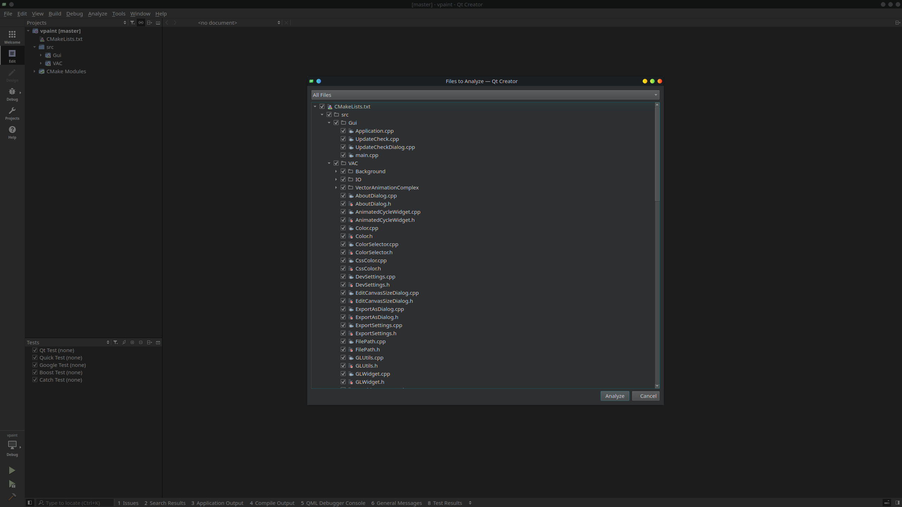

Klikom na dugme Analyze pokreće se analiza nad odabranim fajlovima (u ovom slučaju analiziraju se svi fajlovi).

Dobijamo rezultat analize oba alata Clang-Tidy i Clazy. Ukoliko želimo da vidimo samo rezultate analize alatom Clang-Tidy, možemo da primenimo filter:

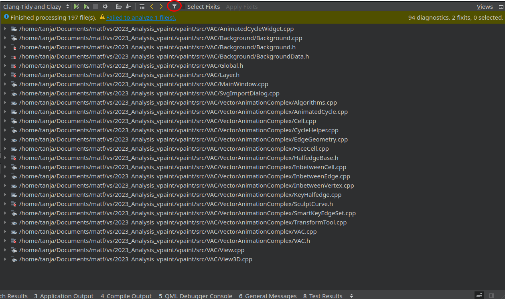

Izabrati provere bez prefiksa `clazy`:

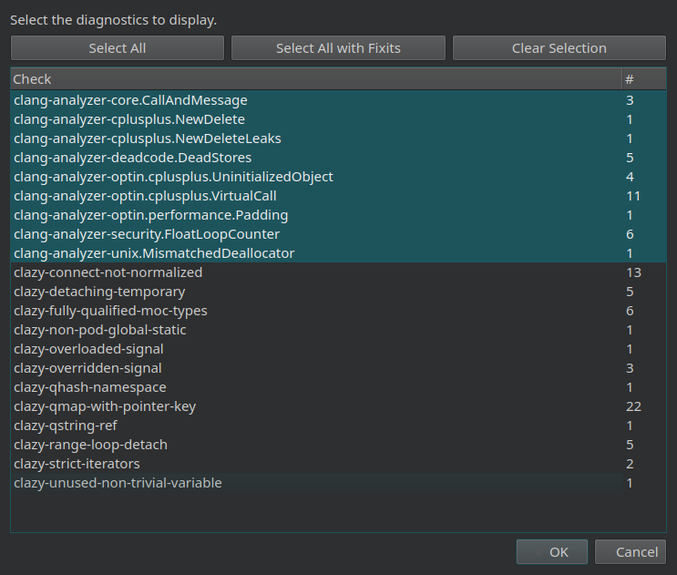

Rezultat Clang-Tidy analize sa predefinisanim podešavanjem:


Neki od dobijenih upozorenja su vezani za potencijalno curenje memorije, korišćenje već oslobođene memorije, pozivanje virtuelnih metoda, inicijalizovanje vrednosti koje se dalje u kodu ne koriste, korišćenje vrednosti u pokretnom zarezu kao brojače petlji.

Jedno zanimljivo upozorenje je `clang-analyzer-unix.MismatchedDeallocator` sa porukom da se koristi pogrešan operator za dealokaciju (`delete` umesto `free`). 

https://github.com/dalboris/vpaint/blob/58593fe8050376fad7195603c03f8d8851fa775d/src/VAC/VectorAnimationComplex/SculptCurve.h#L187-L205

Međutim, za sve potklase klase Fitter važi da je definisan makro EIGEN_MAKE_ALIGNED_OPERATOR_NEW spoljašnje biblioteke Eigen koji definiše operator delete tako da se njime poziva funkcija free. 

https://github.com/eigenteam/eigen-git-mirror/blob/36b95962756c1fce8e29b1f8bc45967f30773c00/Eigen/src/Core/util/Memory.h#L788-L812

Clang-Tidy ne analizira spoljašnje biblioteke i zato prijavljuje **lažno upozorenje** jer ne može da zna da je predefinisan operator delete.

### Clazy

Clazy je takođe alat za statičku analizu u okviru kompajlera clang, ali namenjen specifično za analizu Qt semantike.

Clazy pokrećemo isto kao i Clang-Tidy, samo što ovog puta biramo upozorenja sa prefiksom clazy u filteru ukoliko želimo da vidimo isključivo upozorenja vezana za Clazy.

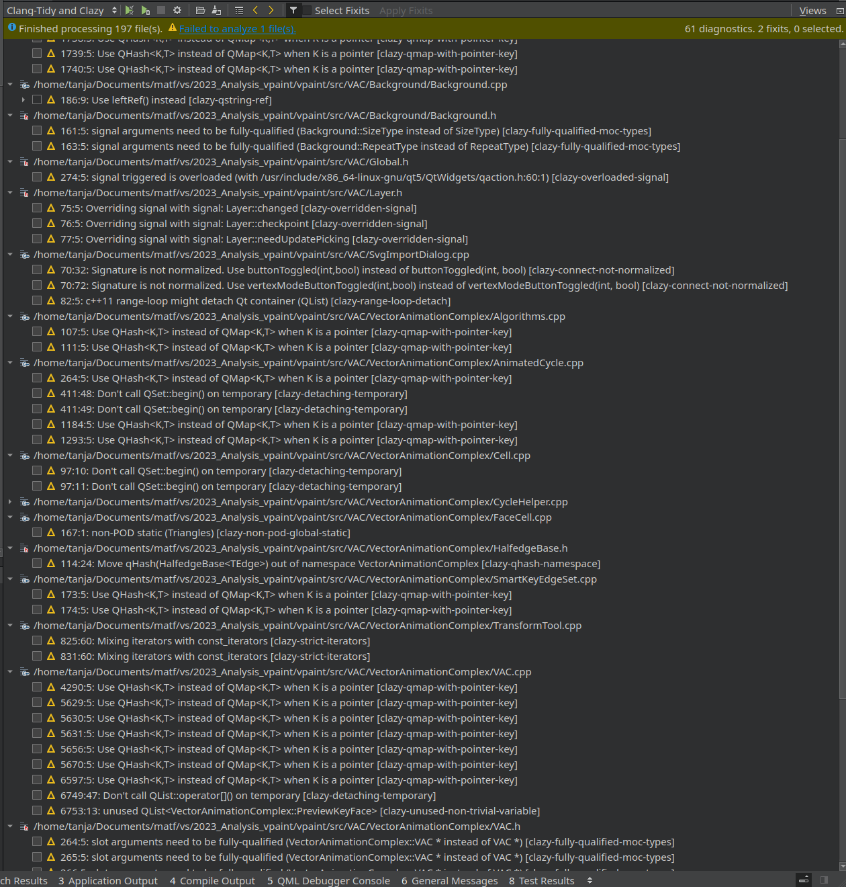

Najviše upozorenja vezano je za korišćenje `QHash` umesto `QMap` kad je potrebno da ključ mape bude pokazivač. Drugo najčešće upozorenje vezano je za definisanje signala po [novoj sintaksi](https://wiki.qt.io/New_Signal_Slot_Syntax) umesto po staroj. Primer u klasi `SvgImportDialog.cpp`:

```c++
connect(buttonBox, SIGNAL(accepted()), this, SLOT(accept()));
```

potrebno je zameniti sa:

```c++
connect(buttonBox, &QDialogButtonBox::accepted, this, &SvgImportDialog::accept);
```

Upozorenje fully-qualified-moc-types označava da je potrebno navesti puna kvalifikovana imena tipova u deklaraciji signala/slotova. Clazy navodi preporuku kako bi trebalo izmeniti deklaraciju. Na primer, sledeće slotove:

```c++
void cut(VAC* & clipboard);
void copy(VAC* & clipboard);
void paste(VAC* & clipboard);
```

je potrebno zameniti sa:

```c++
void cut(VectorAnimationComplex::VAC* & clipboard);
void copy(VectorAnimationComplex::VAC* & clipboard);
void paste(VectorAnimationComplex::VAC* & clipboard);
```

### Zaključak

Oba Clang alata su se pokazala korisnim. Clang-Tidy analizom je pronađeno potencijalno curenje memorije, mrtav kod i neke druga upozorenja vezana za sintaksu i performanse koda. Upozorenja dobijena Clazy alatom mogu da skrenu pažnju na korišćenje novije sintakse i na neke dobre prakse prilikom rada u u Qt razvojnom okruženju. Naravno, kao što je viđeno u primeru upozorenja za korišćenje pogrešnog dealokatora, potrebno je razumeti kod, prepoznati lažna upozorenja i znati koje ispravke je moguće primeniti.


## Cppcheck

Cppcheck je alat za statičku analizu koda koji služi za detekciju bagova. 

Cppcheck se može instalirati pokretanjem sledeće komande u terminalu

```bash
sudo apt install cppcheck
```

Nakon instalacije, pozicioniranjem u direktorijum `cppcheck` pokrenuti komandu kojom se projekat analizira alatom:

```bash
cppcheck --enable=all -isrc/Third --suppressions-list=suppressions.txt --output-file=cppcheck_txt_report.txt ../vpaint
```

Objašnjenje dodatnih opcija:
- `--enable=all` - označava da su sve provere uključene
- `-isrc/Third` - direktorijum na lokaciji `src/Third` je isključen iz analize u kome se nalaze sve spoljašnje biblioteke koje se koriste u projektu. Cilj analize alatom Cppcheck je pronađe bagove u trenutnom projektu (VPaint), a ne u spoljašnjim bibliotekama.
- `--suppressions-list=suppressions.txt` - putanja do fajla u kome su navedene sve provere koje će se ignorisati prilikom analize. U ovom slučaju, provere koje su izostavljene su *missingInclude* i *information*. 
- `--output-file=cppccheck_txt_report.txt` - putanja do fajla u kome će biti upisan rezultat analize

Komanda se može pokrenuti i skriptom [`cppcheck.sh`](cppcheck/cppcheck.sh). Rezultat analize se može videti u fajlu [`cppcheck_txt_report.txt`](cppcheck/cppcheck_txt_report.txt), međutim ukoliko želimo čitljiviji rezultat, Cppcheck omogućava generisanje *html* izveštaja. Najpre je potrebno izveštaj sačuvati u *xml* formatu:

```bash
cppcheck --enable=all -isrc/Third --suppressions-list=suppressions.txt --output-file=cppcheck_xml_report.xml --xml ../vpaint
```

HTML izveštaj se onda generiše i čuva u direktoriijumu `report` na sledeći način:

```bash
cppcheck-htmlreport --file cppcheck_xml_report.xml --report-dir=report
```

Ovi koraci se mogu naći u skripti [`cppcheck-htmlreport.sh`](cppcheck/cppcheck-htmlreport.sh).

Najviše upozorenja je tipa `style`, pri čemu su uočene funkcije koje su definisane a nekorišćene, nedostatak ključne reči override kod funkcija koje bi trebalo da pregaze istoimene funkcije iz bazne klase, napomena da neke promenljive mogu biti definisane kao `const`. Jedno od zanimljivijih preporuka se odnosi na definisanje `explicit` konstruktora ukoliko oni imaju samo jedan argument:

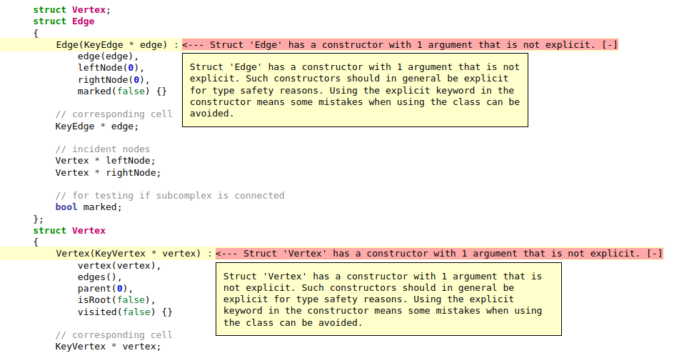


Drugi zanimljiviji primeri iz izveštaja:

Upozorenje o "senčenju" promenljivih kada se radi grananje ili u petljama. Preporuka je da se koriste jedinstveni nazivi promenljivih radi lakše čitljivosti i izbegavanja grešaka.

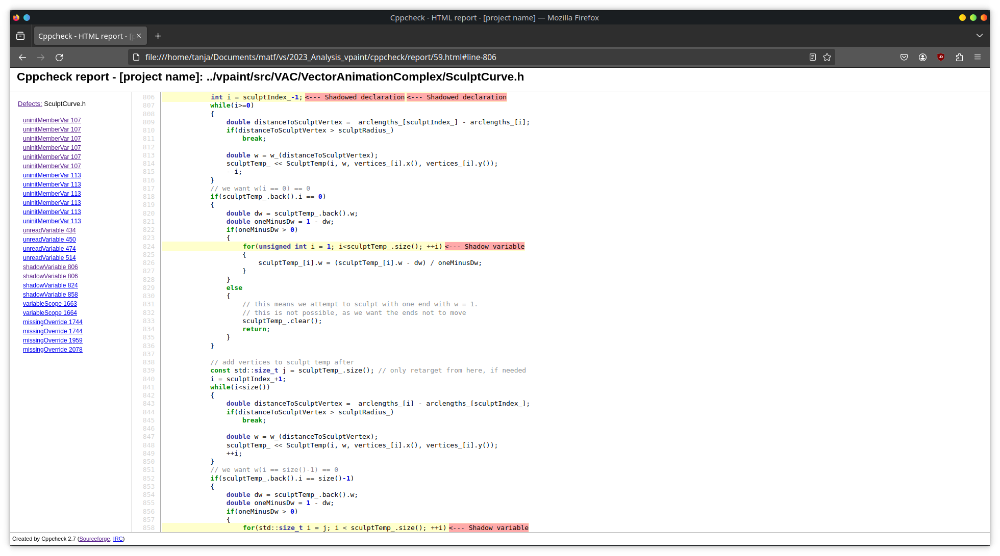

Upozorenje da se assert izrazi zanemaruju tokom prevođenja u *release* modu i da se funkcija koja ima sporedne efekte neće izvršavati u tom slučaju.

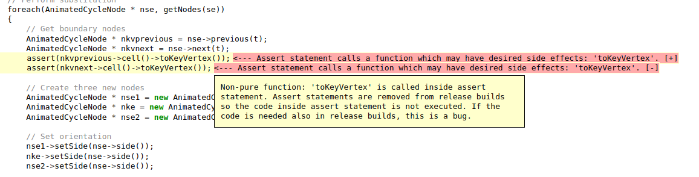

Neki značajniji bagovi nisu uočeni analizom. Cppcheck je naredni deo koda označio kao `error`:

```
../vpaint/src/VAC/VectorAnimationComplex/Cell.cpp:580:5: error:There is an unknown macro here somewhere. Configuration is required. If foreach is a macro then please configure it. [unknownMacro]
    foreach(Cell * c, spatialBoundary())
```

Međutim, `foreach` makro se nalazi u okviru Qt biblioteke što statički analizator ne može da zna.

### Zaključak

Izveštaj dobijen analizom Cppcheck daje dobre preporuke za poboljšanje čitljivosti koda i izbegavanje potencijalnih grešaka. Ovaj alat je dobar dodatak uz prethodno korišćene Clang alate za statičku analizu jer prijavljuje upozorenja koja se nisu pojavila primenom drugih alata. Kao i za druge alate, moguča su lažna upozorenja jer Cppcheck ne analizira spoljašnje biblioteke.


## Valgrind

Valgrind je projekat otvorenog koda koji omogućava naprednu dinamičku analizu koda. U okviru *Valgrind*-a mogu se koristiti sledeći alati:
- *Memcheck* - detktor memorijskih grešaka
- *Massif* - praćenje rada dinamičke memorije
- *Callgrind* - profajler funkcija
- *Cachegrind* - profajler keš memorije
- *Helgrind* i *DRD* - detektori grešaka pri radu sa nitima

Valgrind se instalira sledećom komandom:

```bash
sudo apt install valgrind
```

Pre pokretanja bilo kog Valgrind alata, neophodno je prevesti program u *debug* modu:

```bash
mkdir build
cd build
cmake -DCMAKE_BUILD_TYPE=Debug ../vpaint
make
cd ..
```

U nastavku su opisani primena i rezultati analize alata Memcheck i Cachegrind.

### Memcheck

Memcheck je alat koji služi za analizu mašinskog koda i detekciju memorijskih grešaka programa. Neki od uobičajenih problema u radu sa memorijom mogu biti curenje memorije, pristup već oslobođenoj memoriji, korišćenje neinicijalizovanih vrednosti, neispravno oslobađanje hip memorije...

Memcheck se može pokrenuti sledećom komandom iz terminala:

```bash
valgrind --tool=memcheck --leak-check=full --show-leak-kinds=all --track-origins=yes --log-file=memcheck.txt ../build/src/GUI/VPaint
```

Pri čemu su korišćene sledeće dodatne opcije:

- `--leak-check=full` - analizira se da li je došlo do curenja memorije u programu. Ukoliko su odabrane opcije full ili yes, zabeležiće se svako mesto u kodu u kome dolazi do curenja memorije.
- -`-show-leak-kinds=all` - prikazuje sve vrste curenja memorije (još uvek dostižno, definitivno izgubljen, indirektno izgubljen, moguće izgubljen)
- `--track-origins=yes` - memcheck prati u kom delu koda je došlo do pojavljivanja neinicijalizovanih vrednosti što omoogućava lakše debagovanje.
- `--log-file=memcheck.txt` - putanja do fajla u kome će biti izveštaj analize

Nakon pokretanja komande i korišćenja programa neko vreme, dobijen je sledeći rezime:
```
==17577== LEAK SUMMARY:
==17577==    definitely lost: 7,096 bytes in 37 blocks
==17577==    indirectly lost: 13,983 bytes in 207 blocks
==17577==      possibly lost: 160 bytes in 1 blocks
==17577==    still reachable: 1,002,132 bytes in 13,399 blocks
==17577==         suppressed: 0 bytes in 0 blocks
```

Ceo izveštaj se može naći u fajlu [memcheck.txt](valgrind/memcheck/memcheck.txt).

Na osnovu rezimea se primećuje se da ima dosta primera curenja memorije. Međutim, pregledanjem individualnih slučaja vidi se da su funkcije iz biblioteka Qt i OpenGL skoro uvek odgovorne za alociranje memorije.

Stek poziva funkcije u kojoj je detektovan indirektno izgubljen blok koji su autori projekta inicijalizovali:

```
==17577== 48 bytes in 1 blocks are indirectly lost in loss record 2,213 of 3,281
==17577==    at 0x4849013: operator new(unsigned long) (in /usr/libexec/valgrind/vgpreload_memcheck-amd64-linux.so)
==17577==    by 0x214ABB: ViewSettingsWidget::ViewSettingsWidget(ViewSettings&, QWidget*) (ViewSettings.cpp:369)
==17577==    by 0x1F765A: View::View(Scene*, QWidget*) (View.cpp:67)
==17577==    by 0x2178FF: ViewWidget::ViewWidget(Scene*, QWidget*) (ViewWidget.cpp:26)
==17577==    by 0x170DD1: MultiView::createView_() (MultiView.cpp:92)
==17577==    by 0x170C07: MultiView::MultiView(Scene*, QWidget*) (MultiView.cpp:74)
==17577==    by 0x15A442: MainWindow::MainWindow() (MainWindow.cpp:121)
==17577==    by 0x14EADB: main (main.cpp:39)
```
U pitanju je inicijalizacija widget-a `QMenu` i action-a `QWidgetAction`.

```c++
    QMenu * displayModeMenu = new QMenu();
    QWidgetAction * displayModeWidgetAction = new QWidgetAction(this);
    displayModeWidgetAction->setDefaultWidget(displayModeWidget);
    displayModeMenu->addAction(displayModeWidgetAction);
    ...
    displayModeButton_->setMenu(displayModeMenu);
```

Inicijalizovani widget-i se dodaju na privatni atribut `displayModeButton_` klase `ViewSettings`. Memcheck upozorava da je došlo do curenja memorije jer se u funkciji nigde ne poziva destruktor inicijalizovanih objekata. Međutim do curenja memorije najverovatnije **neće** doći jer pozivom destruktora roditeljskog Qt objekta pozivaju se i destruktori svih naslednika, što se i spominje u [dokumentaciji za QObject](https://doc.qt.io/qt-6/qobject.html#dtor.QObject) (nadklasa svih objekata `Qt` biblioteke).

### Cachegrind

Cachegrind je profajler keš memorije koji prati pogotke i promašaje u keš memoriji. Dodatno, meri i tačan broj instrukcija na nivou fajla, funkcija ili linija koje je izvršio program koji se analizira. 

Naredna komanda pokreće analizu Cachegrind-a:

```bash
valgrind --tool=cachegrind --cache-sim=yes ../../build/src/Gui/VPaint
```

Dodatna komanda koja se koristi u ovom slučaju je `--cache-sim=yes` koja omogućava prikupljanje informacija o pogocima i promašajima u keš memoriji. Rezultat analize se upisuje u fajl pod nazivom `cachegrind.out.<pid>`. 

Nakon nekog vremena korišćenja programa, ispisuju se statistike o izvršavanju programa:

```
==5884== I   refs:      7,426,696,543
==5884== I1  misses:       50,940,875
==5884== LLi misses:        8,016,607
==5884== I1  miss rate:          0.69%
==5884== LLi miss rate:          0.11%
==5884== 
==5884== D   refs:      3,174,003,465  (1,838,695,292 rd   + 1,335,308,173 wr)
==5884== D1  misses:      300,450,223  (  128,787,326 rd   +   171,662,897 wr)
==5884== LLd misses:      204,030,158  (   88,631,006 rd   +   115,399,152 wr)
==5884== D1  miss rate:           9.5% (          7.0%     +          12.9%  )
==5884== LLd miss rate:           6.4% (          4.8%     +           8.6%  )
==5884== 
==5884== LL refs:         351,391,098  (  179,728,201 rd   +   171,662,897 wr)
==5884== LL misses:       212,046,765  (   96,647,613 rd   +   115,399,152 wr)
==5884== LL miss rate:            2.0% (          1.0%     +           8.6%  )
```

Primećujemo da je najviše promašaja na nivou `D1` keš memorije (deo keš memorije u koji se smeštaju podaci).

Ukoliko želimo detaljniji izveštaj, koristimo komandu `cg_annotate`.

```bash
cg_annotate cachegrind.out.* > cachegrind-report.txt
```

```
--------------------------------------------------------------------------------
I1 cache:         32768 B, 64 B, 8-way associative
D1 cache:         49152 B, 64 B, 12-way associative
LL cache:         12582912 B, 64 B, 12-way associative
Command:          ../../build/src/Gui/VPaint
Data file:        cachegrind.out.5884
Events recorded:  Ir I1mr ILmr Dr D1mr DLmr Dw D1mw DLmw
Events shown:     Ir I1mr ILmr Dr D1mr DLmr Dw D1mw DLmw
Event sort order: Ir I1mr ILmr Dr D1mr DLmr Dw D1mw DLmw
Thresholds:       0.1 100 100 100 100 100 100 100 100
Include dirs:     
User annotated:   cachegrind.out.9430
Auto-annotation:  on

--------------------------------------------------------------------------------
Ir                     I1mr                ILmr               Dr                     D1mr                 DLmr                Dw                     D1mw                 DLmw                 
--------------------------------------------------------------------------------
7,426,696,543 (100.0%) 50,940,875 (100.0%) 8,016,607 (100.0%) 1,838,695,292 (100.0%) 128,787,326 (100.0%) 88,631,006 (100.0%) 1,335,308,173 (100.0%) 171,662,897 (100.0%) 115,399,152 (100.0%)  PROGRAM TOTALS

--------------------------------------------------------------------------------
Ir                     I1mr                ILmr               Dr                   D1mr                 DLmr                Dw                   D1mw                 DLmw                  file:function
--------------------------------------------------------------------------------
3,573,546,057 (48.12%) 23,694,188 (46.51%) 4,605,407 (57.45%) 732,164,976 (39.82%)  11,574,933 ( 8.99%)  2,131,698 ( 2.41%) 470,965,153 (35.27%)  66,361,966 (38.66%)  11,837,330 (10.26%)  ???:???
  734,864,144 ( 9.89%)    120,350 ( 0.24%)    12,371 ( 0.15%) 213,946,342 (11.64%) 102,893,289 (79.89%) 83,860,129 (94.62%) 213,416,904 (15.98%) 102,985,522 (59.99%) 102,801,012 (89.08%)  ./string/../sysdeps/x86_64/multiarch/memmove-vec-unaligned-erms.S:__memcpy_avx_unaligned_erms
   96,687,356 ( 1.30%)      7,679 ( 0.02%)       422 ( 0.01%)  34,435,565 ( 1.87%)   3,598,029 ( 2.79%)     37,602 ( 0.04%)   8,067,176 ( 0.60%)       5,277 ( 0.00%)         146 ( 0.00%)  ./elf/./elf/dl-lookup.c:do_lookup_x
   93,867,880 ( 1.26%)      1,866 ( 0.00%)     1,199 ( 0.01%)  22,086,560 ( 1.20%)           0                   0           24,847,380 ( 1.86%)           0                    0           /home/tanja/Documents/matf/vs/2023_Analysis_vpaint/vpaint/src/VAC/../Third/Eigen/src/Core/DenseCoeffsBase.h:Eigen::DenseCoeffsBase<Eigen::Matrix<double, 2, 1, 0, 2, 1>, 0>::coeff(long) const
   88,929,086 ( 1.20%)    180,923 ( 0.36%)     8,828 ( 0.11%)  15,316,588 ( 0.83%)       2,720 ( 0.00%)          0            6,582,332 ( 0.49%)     111,319 ( 0.06%)      10,136 ( 0.01%)  ???:QBezier::addToPolygon(QDataBuffer<QPointF>&, double) const

...
...
...
```

Od funkcija vezanih za projekat, najviše puta se izvršava funkcija iz spoljašnje biblioteke Eigen `DenseCoeffsBase<Eigen::Matrix<double, 2, 1, 0, 2, 1>, 0>::coeff(long)`. Takođe primećujemo da je broj promašaja keša vezana za tu funkciju veoma nizak što ukazuje na efikasnost. Zapravo, pregledom [celog izveštaja](valgrind/cachegrind/cachegrind-report.txt) primećujemo da većina funkcija napisana u okviru projekta VPaint ili biblioteke Eigen ima relativno mali broj promašaja čitanja/pisanja keš memorije.

Još pregledniji način analize izveštaja je pomoču alata KCachegrind.

```bash
kcachegrind cachegrind.out.*
```

Pomoću grafičkog korisničkog interfejsa možemo da pregledamo svaku funkciju pojedinačno i da vidimo u kom delu koda ima najviše čitanja, pisanja, promašaja.

Primer za funkciju koja ima nešto veći broj promašaja čitanja keša podataka:

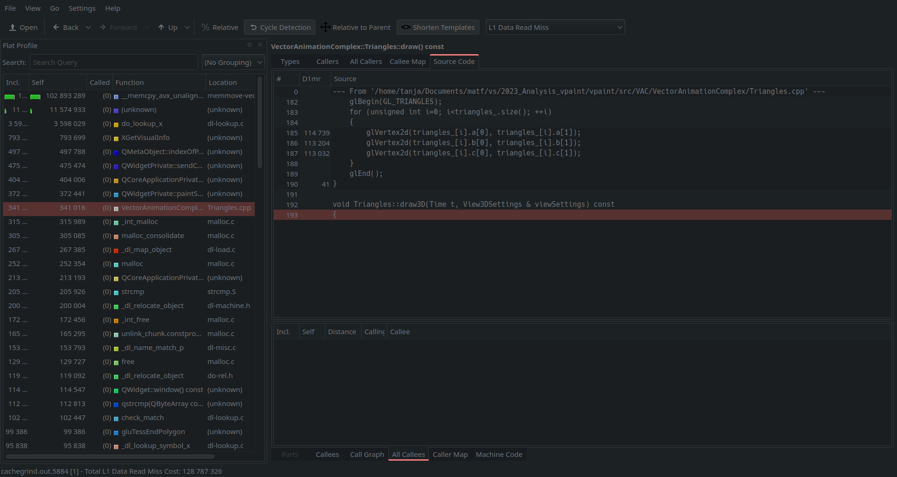

Ova funkcija pristupa nizu u kom su sačuvani trouglovi i iscrtava ih pomoću funkcija biblioteke GLU. S obzirom na to da je iscrtavanje glavna funkcionalnost programa i da se ona sva rade pomoću trouglova, očekivano je da imamo dosta pristupa pa i promašaja u keš memoriji gde se čuva ovaj niz. Možemo da proverimo da li se ova funkcija češće poziva od drugih:

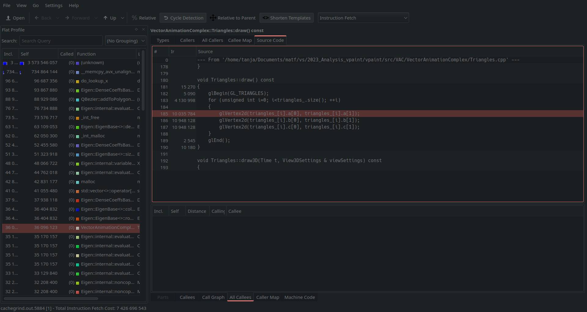

Zaista, funkcija `draw()` se poziva najviše puta od svih drugih iz projekta VPaint.

## Perf

Perf je alat za profajliranje na Linux sistemima. Perf pruža mogućnost merenja događaja iz različitih izvora kao na primer, brojača kernela i procesora. Ovaj alat se može instalirati na sledeći način:

```
sudo apt install perf
```


```bash
sudo perf record --call-graph dwarf ./../build/src/Gui/VPaint
sudo perf report
```

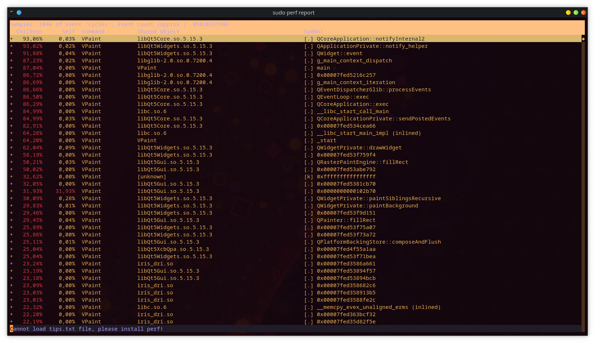

Za vizuelizaciju može da se koristi alat `hotspot`, projekat otvorenog koda.

```bash
sudo apt install hotspot
sudo hotspot perf.data
```

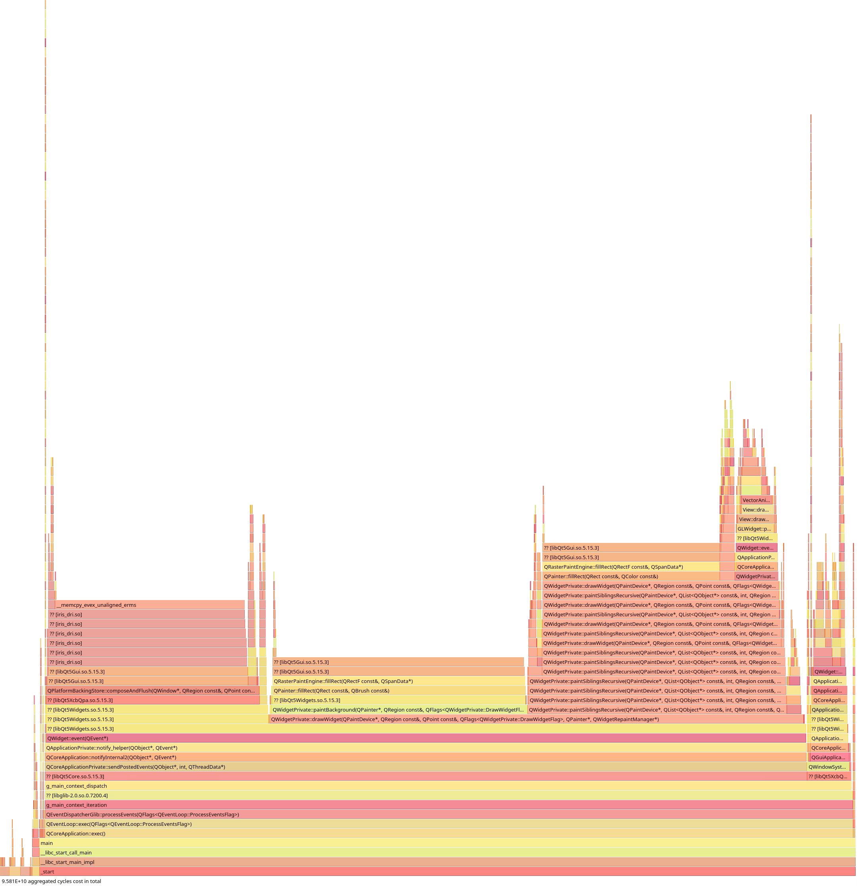